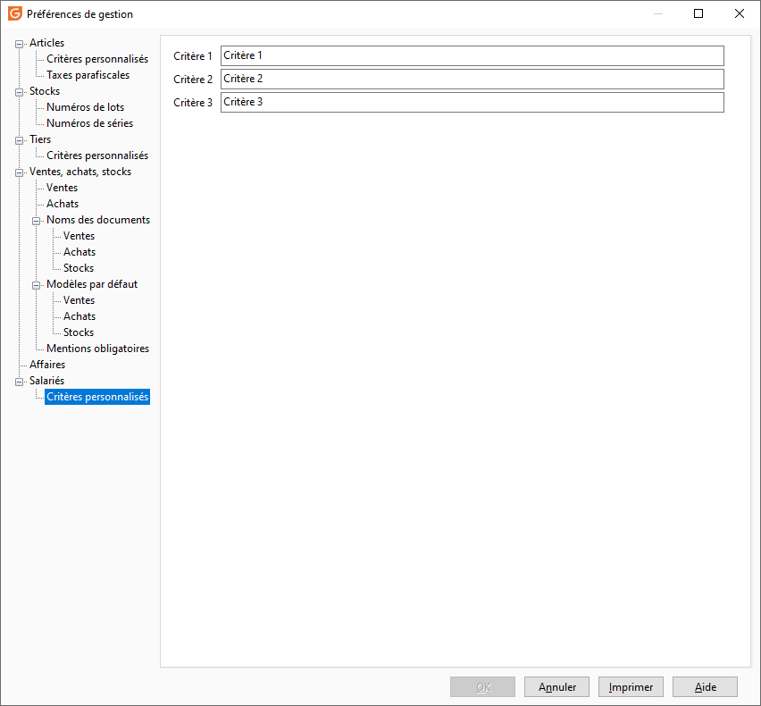

# Critères personnalisés

 

Il est possible de définir 3 critères vous permettant d'ajouter des informations complémentaires afin que votre base salariés réponde aux caractéristiques propres à votre activité commerciale. Ici il s'agit de nommer chaque critère, pour ensuite venir enrichir leur menu déroulant dans [les tables de référence](../../TablesReferences/2/Articles.md).

