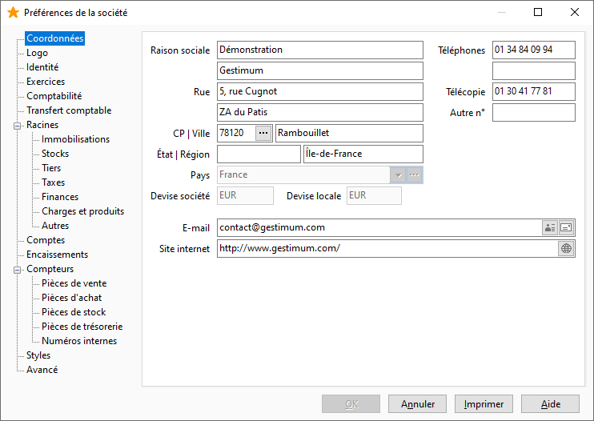

# Coordonnées

Toutes les informations saisies en création de la société sont modifiables 
 dans cet onglet, à l'exception de la Raison sociale, pays et devise.

 

## Pays

Le choix du pays où la société est installée est très important (par 
 défaut France), puisqu'il détermine la devise société, c’est-à-dire la 
 devise de travail. Le pays permet la génération automatique des villes 
 (codes postaux), du plan comptable (suisse, anglais, marocain, ...) et 
 des journaux comptables spécifiques au pays.

 

Cas particulier [la 
 création de société en devise Euro](../../Nouvelle/1/CreerNouvelleSociete.md).

## E-mail et site Internet

L’icône située à droite du champ permet respectivement d’envoyer un 
 mail et de se connecter au site.

