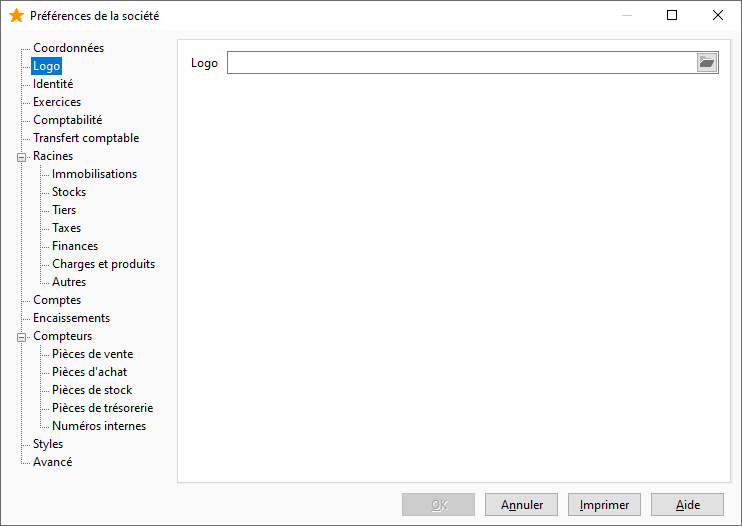

Logo

Vous pouvez sélectionner un fichier de type image (png, jpeg...) et qui pourra servir dans vos modèles d'impressions.

 

 

La bibliothèque de modèles fournit avec le logiciel utilise ce champ pour afficher le logo.

