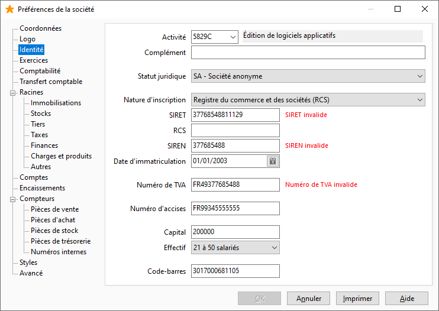

Identité

 

Certaines de ces informations renseignées dans cet onglet vous serviront lors de la réalisation de documents fiscaux. (DEB, Bilan, Compte de résultat, Export liasses fiscales txt, …) :

* Code activité (APE) provenant des [tables de référence](../../TablesReferences/2/TablesReferenceGenerales.htm),
* Complément au code d'activité,
* Statut juridique provenant des [tables de référence](../../TablesReferences/2/TablesReferenceGenerales.htm),
* Nature d'inscription provenant des [tables de référence](../../TablesReferences/2/TablesReferenceGenerales.htm),
* Numéro de SIRET,
* Numéro RCS,
* Numéro SIREN,
* Date d'immatriculation,
* Numéro de TVA : Utilisé dans la déclaration de TVA,
* Numéro d'accises : Utilisé dans la gestion des taxes sur les alcools,
* Capital,
* Effectif provenant des [tables de référence](../../TablesReferences/2/TablesReferenceGenerales.htm),
* Code barre : Utilisé dans la gestion EDI.

