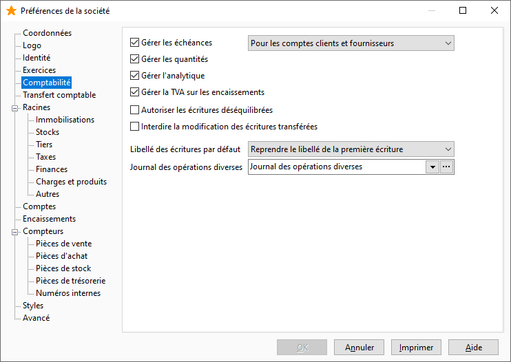

# Comptabilité

Cet onglet vous permet de paramétrer "les gestions" supportées 
 par votre comptabilité et de sélectionner les informations par défaut 
 de vos journaux et transfert comptable.

 

## Gestion des échéances

À activer pour suivre vos échéances. La gestion des échéances doit être 
 sélectionnée au niveau des journaux et des comptes.

 

En dessous de cette option, une liste déroulante permet de limiter le 
 choix de la gestion des échéances aux clients et fournisseurs ou à tous 
 les comptes.

 

Pour les échéances créées par erreur sur des comptes autres que les 
 clients ou les fournisseurs, le fait de décocher l'option "gestion 
 des échéances" sur la fiche compte, provoquera la suppression de 
 toutes les échéances rattachées à ce compte, sauf s'il existe une échéance 
 soldée pour ce compte. Un message vous avertit avant la suppression.

## Gestion des quantités

La gestion des quantités permet de gérer en plus du débit et du crédit, 
 une notion de quantité sur l'écriture (quantité de produits achetés, nombre 
 de SICAV,…). Le format des quantités est à déterminer dans [l'onglet 
 Général](../2-9/OngletAvance.md).

## Gestion de l’analytique

Vous devez sélectionner cette option pour gérer l’analytique.

 

Si le paramétrage des comptes comptables ou des natures comptables est 
 effectué avec des sections analytiques et suivant l’option 
 paramétrée dans les préférences de la gestion (onglet Ventes et Achats), 
 lors du transfert comptable en comptabilité Gestimum V3, l’analytique sera automatiquement renseignée 
 sur les écritures comptables.

## Gestion de la TVA sur Encaissements

Permet d'enregistrer de la TVA sur Encaissements à la saisie d'un règlement 
 dans un journal de type Trésorerie.

## Autoriser les pièces comptables déséquilibrées

Cette option permet à l'utilisateur en saisie comptable de sortir du 
 journal alors que l'écriture comptable n'est pas équilibrée, un message 
 d'avertissement non bloquant signale le déséquilibre. Autrement, l'utilisateur 
 doit saisir la contrepartie pour quitter le journal.

## Interdire la modification des écritures

Cette option permet de bloquer toutes les modifications sur les écritures 
 qui sont créées lors du transfert comptable.

## Le paramétrage des journaux

### Libellé des écritures par défaut

Ce choix de libellé sera par défaut proposé en création d'une fiche 
 journal. Au choix : l'intitulé du compte saisi dans la fiche du compte, 
 le libellé de la première écriture ou à saisir.

### Journal des Opérations Diverses

Permet de préciser le journal dans lequel seront générées les écritures 
 d’écarts éventuels lors du transfert comptable.

## Le libellé automatique des écritures lors du transfert comptable

En fonction des différents types (Factures, Avoirs, Règlement en portefeuille, 
 Remise en banque, Remise à l’encaissement, Avis d’encaissement, Remise 
 à l’escompte, Avis d’escompte, Règlements impayés, Émissions de paiements) 
 un libellé pourra être choisi et permettra d’avoir un libellé automatique 
 sur les écritures générées lors du transfert comptable.

 

La création des différents libellés s’effectue par le menu SOCIETE/Paramétrage/Tables 
 de Références - [Libellés 
 automatiques](../../TablesReferences/2/Comptabilite.md).

 

 

