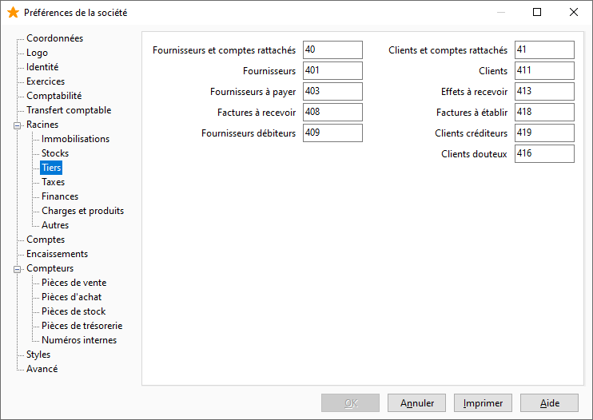

Racines

La saisie des racines de compte pour chaque type de compte, sert au contrôle de la saisie des comptes et permet de définir des racines spécifiques au pays de la société.

 

Il suffit de cliquer sur le bouton de chaque type de compte : [Immobilisations](OngletRacinesImmoibilisations.htm), [Stocks](OngletRacinesStocks.htm), [Tiers](OngletRacinesTiers.htm), [Taxes](OngletRacinesTaxes.htm), [Finances](OngletRacinesFinances.htm), [Charges et produits](OngletRacinesChargesProduits.htm) et [Autres](OngletRacinesAutres.htm) pour accéder à la saisie des racines correspondantes.

 

//<![CDATA[
 if( typeof( FilePopupInit ) != 'function' ) FilePopupInit = new Function();
 FilePopupInit('a1');
 FilePopupInit('a2');
 FilePopupInit('a3');
//]]>

