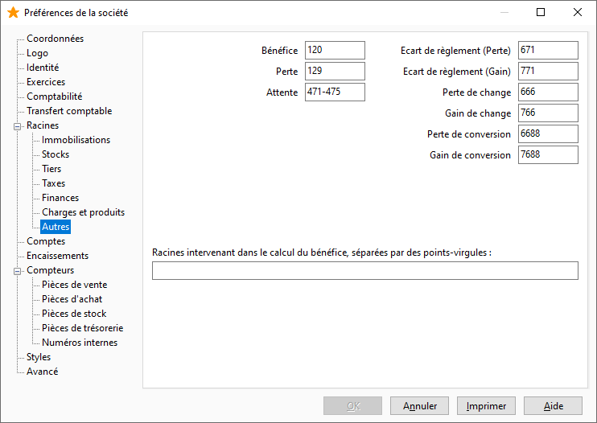

# Autres

Cet onglet vous permet de saisir les racines des comptes nécessaires lors de la clôture comptable :

 

* de bénéfices et pertes de résultat ; Il est également possible de définir les racines intervenant dans le calcul du bénéfice.
* d'attente
* d'écart de règlement (perte et gain)
* de change (perte et gain)
* de conversion (perte et gain)

 

