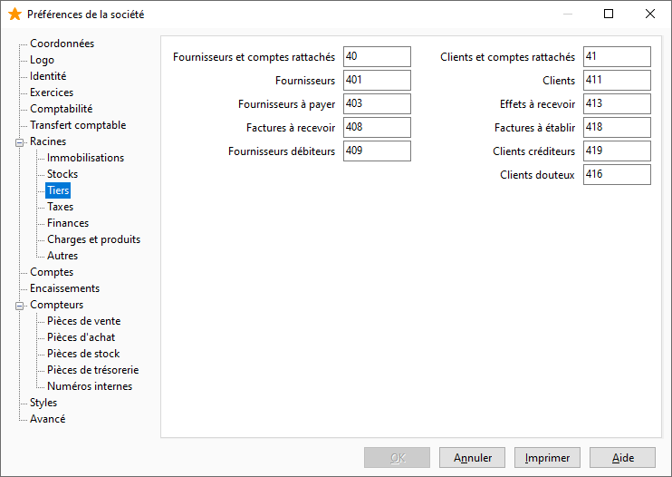

Tiers

Cet onglet permet de saisir les racines des comptes Fournisseurs et Clients.

 

 

La saisie des racines des comptes "Fournisseurs" et "Clients" est importante car elle réalise la création des comptes collectifs.

 

Un contrôle de cohérence est réalisé à la saisie du début des racines "Fournisseurs/Clients et comptes rattachés" et "Fournisseurs/Clients". S’il y a incohérence, un message d’avertissement vous informe du problème et demande la confirmation ou non de votre saisie.

 

Vous devez renseigner la racine "Effets à recevoir" pour pouvoir sélectionner le compte d’effet lors de la mise en portefeuille.

