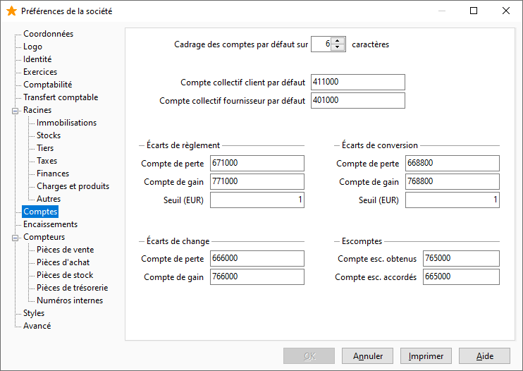

Comptes

Cet onglet vous permet de paramétrer par défaut les fiches comptes du plan comptable.

 

# Cadrage des comptes

La longueur maximale d'un compte est de 15 caractères.

 

Le cadrage de compte permet de définir une longueur minimale. De ce fait, lorsque la longueur d'un compte est inférieure à la longueur demandée, le logiciel ajoute autant de zéros que nécessaire. Si vous indiquez zéro (0), aucun cadrage ne sera effectué.

 

Suite au changement de cadrage des comptes, vous avez la possibilité de modifier tous les comptes généraux du plan comptable afin qu’ils respectent celui-ci. Ceci est possible à partir de l'option "réimputation de compte" du menu Outils de la comptabilité.

# Compte collectif client / fournisseur

Lors de la création d’une fiche tiers, le compte comptable automatiquement créé sera rattaché à l’un de ces deux comptes collectifs.

Les écarts de règlement, conversion, change.

# Comptes de perte et de gain

Ces comptes sont automatiquement proposés et créés par défaut dans le plan comptable dès lors qu’une racine de compte a été indiquée dans Écart de règlement, Écart de change et Écart de conversion Euro (voir l'onglet Racines + Divers).

 

Lors du transfert comptable les écarts sont traités et les écritures correspondantes sont générées dans un journal d'OD.

# Écart de règlement (seuil)

L'écart de règlement permet de solder une échéance lorsque l'écart de règlement en valeur absolue est inférieur ou égal à ce montant. Il est également utilisé lors du lettrage des écritures.

 

Ce montant est exprimé en devise société.

 

Pour un écart de règlement paramétré à 5,00 €, si nous prenons comme exemple une facture de 100,00 €, tout règlement d’un montant compris entre 95,00 et 105,00 € aura pour conséquence de solder l’échéance et de générer un écart de règlement correspondant.

# Écart de conversion euro

C'est le montant maximum d'écart de conversion d'une devise vers la devise société. Ce montant est à exprimer en devise société.

# Comptes d'escomptes obtenus et accordés

Ces comptes sont automatiquement proposés et créés dans le plan comptable par défaut dès lors qu’une racine de compte a été indiquée dans Escomptes obtenus et escompte accordés (voir [l'onglet Racines](../2-5/OngletRacines.htm) + Charges et produits).

 

 

