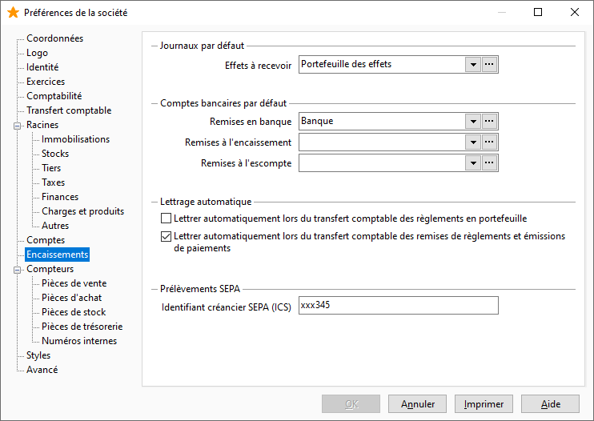

Encaissements

Cet onglet vous permet de paramétrer par défaut les journaux de trésorerie utiles pour la gestion des encaissements ainsi que le lettrage des écritures pendant le transfert comptable.

 

# Paramétrage par défaut

Vous pouvez sélectionner par défaut :

* le journal des EFFETS À RECEVOIR
* les comptes bancaires par défaut pour les remises à l’encaissement et les remises à l’escompte

# Lettrage automatique des écritures pendant le transfert comptable

Lorsque les options "Lettrage automatique lors du transfert comptable des règlements en portefeuille" et "Lettrage automatique lors du transfert comptable des remises en banque de règlements et émissions de paiements" sont sélectionnées, le lettrage automatique de la facture avec le règlement lors du transfert comptable est possible.

 

Pour que le [lettrage se réalise](../Trier/LettrageAutomatiqueTransfertComptable.htm), il faut être dans les situations suivantes :

* L’option doit être cochée dans les préférences,
* La facture dit être mono échéance,
* les factures et avoirs doivent être transférés avant les règlements,
* L’échéance doit être soldée et réglée en une fois mais le règlement peut regrouper plusieurs échéances,
* Le règlement et la facture ne doivent pas être transférés en mode simulation.

 

Remarque : Une remise lettrée ne pourra être supprimée que si elle est délettrée préalablement.

# Prélèvements SEPA

Vous devez indiquer ici votre numéro identifiant créancier pour pouvoir faire des prélèvement SEPA.

