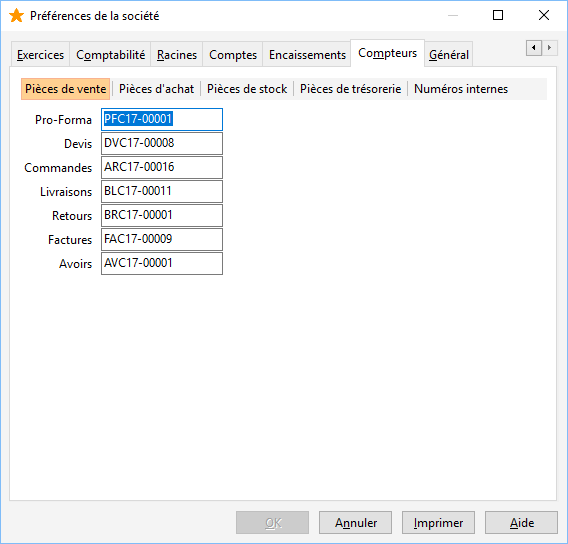

Compteurs

## Paramétrages des compteurs

Le numéro est basé sur un préfixe (composé de caractères alphabétiques uniquement) et d'une partie numérique qui s'incrémente de 1 et 1. Il est toutefois possible de paramétrer un numéro sans préfixe ou sans partie numérique. Enfin, il sera toujours possible d’imposer un numéro de pièce manuellement en entête du document avant enregistrement du document.

## Type de compteur paramétrable

Pour chaque type de documents, une numérotation de pièce peut être programmée dans les onglets [ventes](OngletCompteursVentes.htm), [achats](OngletCompteursAchats.htm) et [stocks](OngletCompteursStocks.htm).

Les onglets [Trésorerie](OngletCompteursTresorerie.htm) et Numéros permettent de paramétrer les numéros des documents de trésorerie et des relances, ainsi que les numéros de pièce des documents divers.

## Remarque

Les [compteurs numériques](OngletCompteursNumeriques.htm) indiquent le nombre total des traitements courants (Documents, écritures ...).

# Compteurs : ventes

Les numéros de pièce des documents de ventes sont paramétrés par défaut dans ce compteur.

 

Il vous est possible de définir les numéros des pièces suivantes :

* Pro-Forma,
* Devis,
* Accusés,
* B. L,
* B. R,
* Factures,
* Avoirs.

 

Les Factures Financières et les Avoirs Financiers n’ont pas de compteurs spécifiques, les numéros de pièces affectés sont ceux des compteurs Factures et Avoirs.

# Compteurs : achats

Les numéros de pièce des documents d’achats sont paramétrés par défaut dans ce compteur.

 

Il vous est possible de définir les numéros des pièces suivantes :

* Demandes,
* Commandes,
* Réceptions,
* Retours
* Factures,
* Avoirs.

 

Les Factures Financières et les Avoirs Financiers n’ont pas de compteurs spécifiques, les numéros de pièces affectés sont ceux des compteurs Factures et Avoirs.

# Compteurs : stocks

Les numéros de pièce des documents de stocks sont paramétrés par défaut dans ce compteur.

 

Il vous est possible de définir les numéros des pièces suivantes :

* Entrées,
* Sorties,
* Pertes,
* Écarts,
* Transferts de dépôt à dépôt,
* Assemblage,
* Inventaires.

# Compteurs : trésorerie

Les numéros de pièce des documents de trésorerie sont paramétrés par défaut dans ce compteur.

 

Il vous est possible de définir les numéros des pièces suivantes :

* Remises de règlements,
* Remises d’effets à l’encaissement,
* Remises d’effets à l’escompte,
* Émissions de paiements.

# Compteurs : numériques

Les compteurs numériques indiquent le nombre total de traitements courants.

 

Il vous est possible de voir le nombre total des compteurs suivants :

* Documents,
* Échéances,
* Relances,
* Règlements, Paiements,
* Remises en banque, émissions de paiements,
* Avis de banque,
* Impayés,
* Écritures comptables,
* Déclaration de TVA : Disponible en comptabilité,
* Filtres,
* Abonnement en Gestion,
* Contact.

 

//<![CDATA[
 if( typeof( FilePopupInit ) != 'function' ) FilePopupInit = new Function();
 FilePopupInit('a1');
 FilePopupInit('a2');
 FilePopupInit('a3');
 FilePopupInit('a4');
 FilePopupInit('a6');
//]]>

