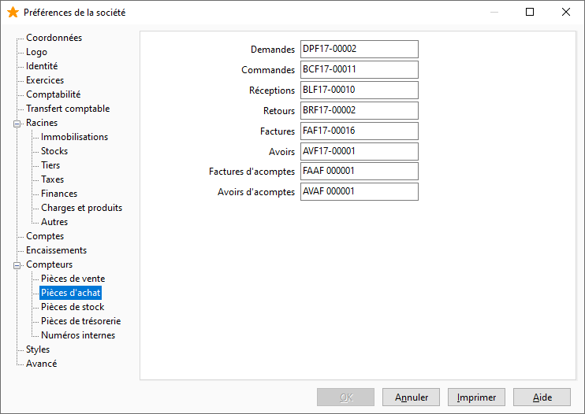

# Pièces d'achat

Les numéros de pièce des documents d’achats sont paramétrés par défaut dans ce compteur.

 

 

Il vous est possible de définir les numéros des pièces suivantes :

* Demandes
* Commandes
* Réceptions
* Retours
* Factures
* Avoirs
* Factures d'acomptes
* Avoirs d'acomptes

 

Les factures financières et les avoirs financiers n’ont pas de compteurs spécifiques. Les numéros de pièces affectés sont ceux des compteurs de factures et avoirs.

