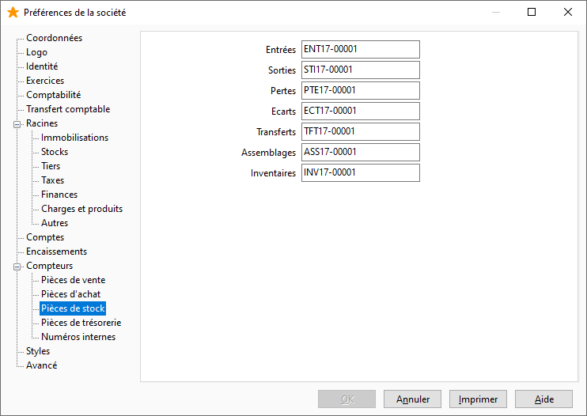

Pièces de stock

Les numéros de pièce des documents de stocks sont paramétrés par défaut dans ce compteur.

 

 

Il vous est possible de définir les numéros des pièces suivantes :

* Entrées
* Sorties
* Pertes
* Écarts
* Transferts de dépôt à dépôt
* Assemblage
* Inventaires

