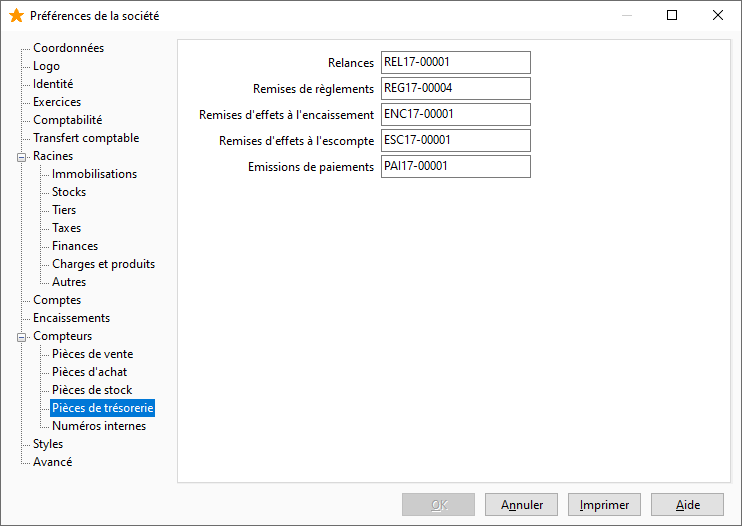

Pièces de trésorerie

Les numéros de pièce des documents de trésorerie sont paramétrés par défaut dans ce compteur.

 

 

Il vous est possible de définir les numéros des pièces suivantes :

* Relances
* Remises de règlements
* Remises d’effets à l’encaissement
* Remises d’effets à l’escompte
* Émissions de paiements

