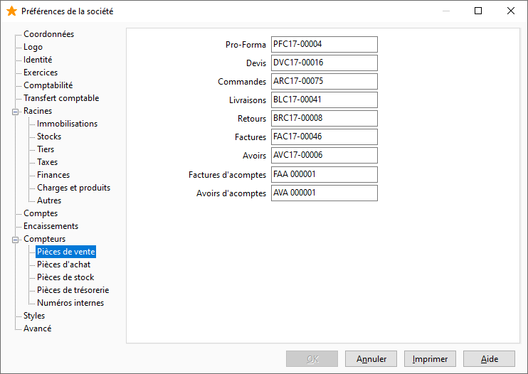

# Pièces de vente

Les numéros de pièce des documents de ventes sont paramétrés par défaut dans ce compteur.

 

 

Il vous est possible de définir les numéros des pièces suivantes :

* Pro-Forma
* Devis
* Commandes
* Livraisons
* Retours
* Factures
* Avoirs
* Factures d'acomptes
* Avoirs d'acomptes

 

Les Factures Financières et les Avoirs Financiers n’ont pas de compteurs spécifiques, les numéros de pièces affectés sont ceux des compteurs Factures et Avoirs.

