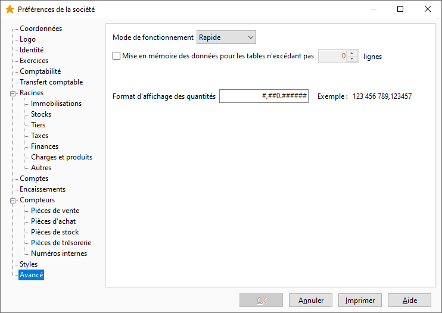

# Avancé

## Mode de fonctionnement

Le choix du mode de fonctionnement sert à accélérer les opérations les 
 plus courantes comme la recherche d’une donnée, l’ouverture d’une liste 
 de données, la création de fiches. Le mode SQL permet de plus, d'activer 
 le [mode Fiche](../Trier/ModeFiche.md).

 

Nous décrivons ci-dessous le comportement de votre logiciel en fonction 
 du mode choisi :

 

 

|   | Mode Rapide | Mode SQL |
| Disponibilité des modes de fonctionnement | Toujours | Toujours |
| Fonctionnement en réseau | Conseillé | Conseillé |
| Gestion des données en mode Liste | Oui | Non |
| Gestion des données en [mode 
 Fiche](../Trier/ModeFiche.htm) | Non | Oui |
| Recherche dans une liste déroulante | Oui | Oui |
| Champs avec appel de liste image\Gest0117_wmf.gif | Oui | Non |
| Accès à la liste complète | Avec image\Gest0119_wmf.gif | Avec l’icône Ouvrir sur une fiche |
| Recherche dans une liste | En majuscule sur le code puis sur le libellé | En majuscule sur le code puis sur le libellé |
| Résultat d’une recherche dans une liste | Extraction : Les données répondant à cette recherche sont 
 extraites | Extraction : Les données répondant à cette recherche sont 
 extraites |
| Utilisation du signe % pour indiquer une partie inconnue 
 (voir exemple) | Non | Oui |
| Filtre avec la condition "Contient" | Non | Oui |

## Mise en cache des données

Cette option permet de mettre en mémoire les listes déroulantes des 
 tables ne dépassant pas un certain nombre d’enregistrements. Les informations 
 des listes déroulantes ne transitent alors plus sur le réseau.

## Format des quantités

Ce format est appliqué uniquement à l’écran lors de la saisie des quantités.

 

Par défaut, il prend ce qui est saisi à l’exception des zéros en décimales.

## Format des chiffres

Par défaut, il prend ce qui est saisi à l’exception des zéros en décimales.

 

Le paramétrage possible est :

* # Pour un chiffre
* 0 Pour champ non renseigné
* . Pour le séparateur de décimales
* , Pour le séparateur de milliers

 

Exemple pour 
 quinze milles :

Le paramétrage sera : #,##0. 00

Le résultat sera : 15 000. 00

