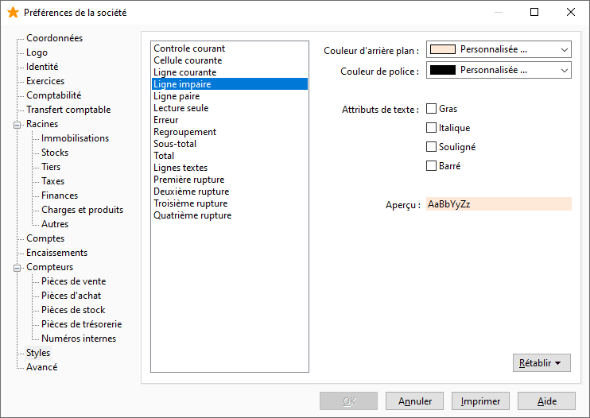

# Styles

Il est possible de déterminer une couleur (texte et fond) et des attributs de texte (gras, italique, souligné, barré) afin d’offrir une meilleure lisibilité des listes/grilles et permettre de mettre en valeur certaines informations ou types d'informations (lignes, cellules et contrôles courants dans les grilles/listes, lignes paires, impaires, les erreurs, le mode Lecture seule).

 

 

Remarque : Pour une cellule donnée, la couleur d’une colonne a priorité sur la couleur de sa ligne.

 

Certaines informations sont spécifiques à chaque application comme pour le logiciel Comptabilité: les écritures de simulation, les écritures.

 

Le bouton rétablir vous permet à tous moment de restaurer la valeur par défaut pour le style sélectionné ou pour tous les styles.

