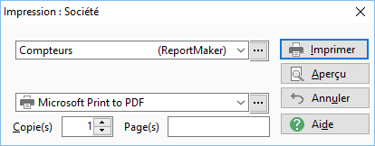
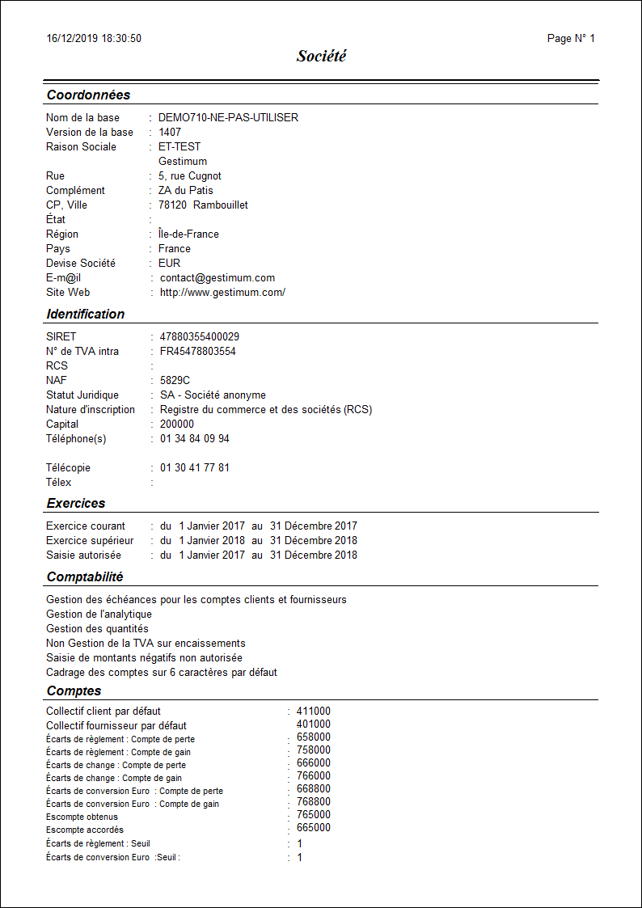

Impression des préférences de la société

# Options

# Compteurs

Cette édition permet l’imprimer le nombre d'enregistrements dans les bases de données suivantes :

 

* Dépôts
* Articles
* Documents
* Lignes
* Mouvements
* Détails lignes articles (nomenclature/forfait)
* Tiers
* Familles de tiers
* Sous-familles de tiers
* Adresses de tiers
* Coordonnées bancaires du tiers
* Barèmes
* Tarifs
* Échéances
* Règlements
* Remise en banque
* Comptes
* Écritures

 

# Société

Cette édition permet l’imprimer les informations générales sur la société :

 

* Adresse et identification de la société
* Exercices de la société
* Paramètres comptable de la société (différentes gestions, comptes collectifs, compte d’écart …)
* Compteurs de documents
* Compteurs numériques

 

