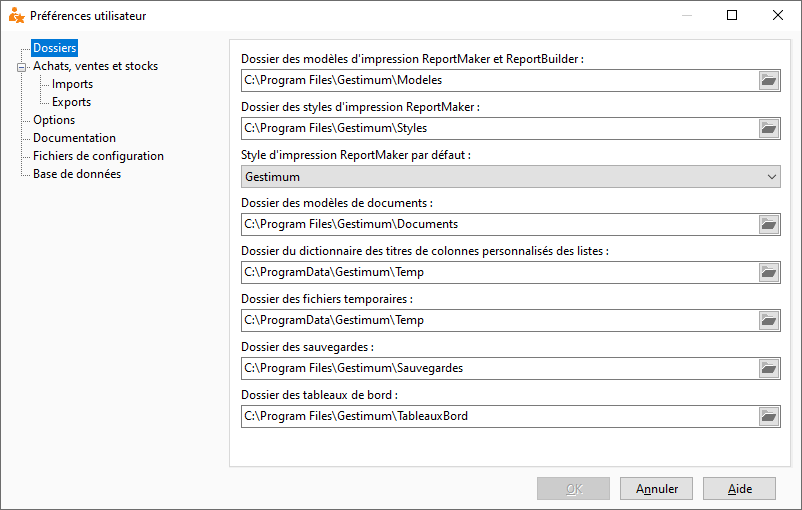

Dossiers

A l'impression, le logiciel recherche des données précises. Cet onglet vous permet d’indiquer les chemins où se trouvent ces données.

 

 

Les répertoires à renseigner sont :

* Les modèles d'impression ReportMaker et ReportBuilder
* Les styles d’impression ReportMaker
* Un style d’impression par défaut ReportMaker
* Les modèles de documents (Documents types : relances clients s'ils ne sont pas en ReportMaker mais en Word, ... )
* Le dictionnaire de traduction des champs
* Les fichiers temporaires (fichiers d’export, transfert comptable…)
* Les fichiers de sauvegardes
* Les fichiers de requêtes des tableaux croisés dynamiques

 

L’icône  permet de pointer ou sélectionner un autre répertoire.

