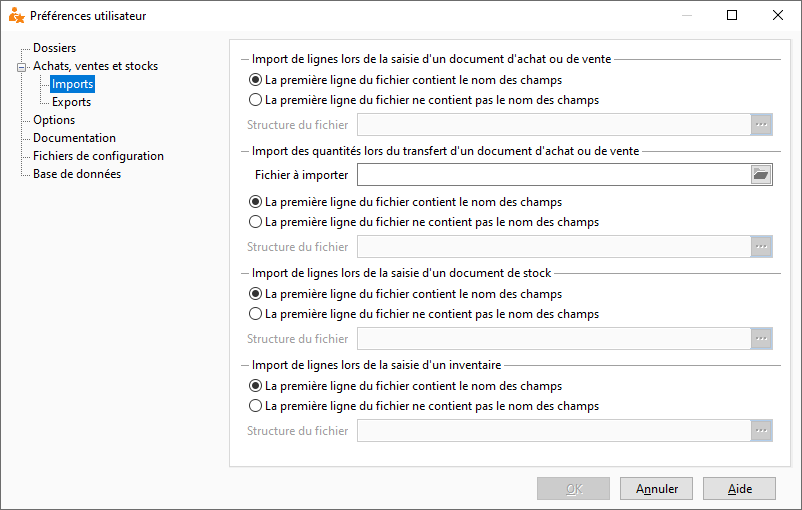

# Imports d'achats, ventes et stocks

Cet onglet permet de définir les formats des fichiers d'import pour 
 les documents d'achats, de ventes et de stocks.

 

## La première ligne du fichier contient le nom des champs

Il faut choisir l'option "la première ligne du fichier contient 
 le nom des champs" si votre fichier d'import précise le nom des champs 
 dans son entête.

## La première ligne du fichier ne contient pas le nom des champs

Sinon, il faut créer le format d'import en choisissant l'option" 
 La première ligne du fichier ne contient pas le nom des champs" qui 
 ouvre une fenêtre de dialogue pour le paramétrage de l'import.

## Fichier à importer

La zone "Fichier à importer" permet de renseigner le fichier 
 dans lequel se trouvent les quantités à importer lors d'un transfert d'accusé 
 de réception en BL ou facture lorsque l'option "Importer automatiquement 
 les quantités à importer" est cochée dans la fenêtre de transfert.

## Structure du fichier

...

