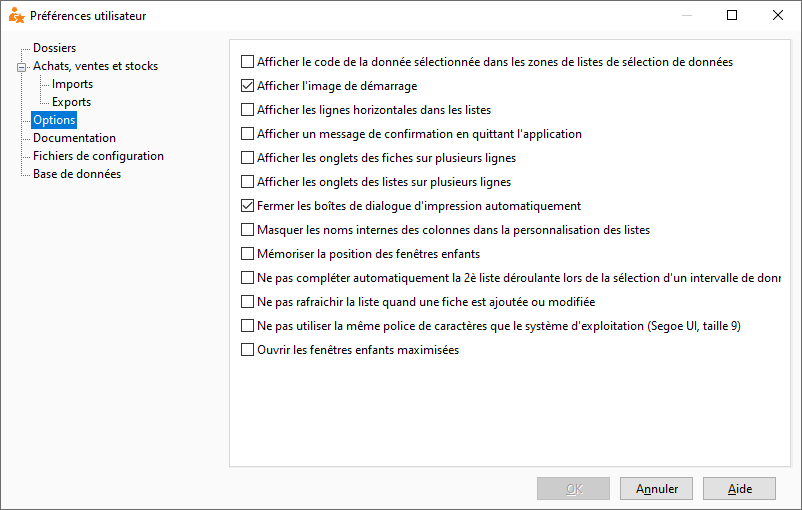

Options

Cet onglet permet de paramétrer différentes options.

 

# Afficher l'image de démarrage

L'affichage du log à l'ouverture du logiciel peut être désactivé avec cette option.

# Afficher les onglets des listes et préférences sur plusieurs lignes

Lorsque plusieurs filtres sont créés sur une même liste, et que tous les onglets ne peuvent être affichés sur une même ligne, il est possible de choisir d'afficher les onglets sur plusieurs lignes ou d’afficher un bouton permettant de défiler vers les onglets non affichés.

# Afficher un message de confirmation en quittant l'application

Cette option "sélectionnée" permet de demander confirmation de fermeture du logiciel.

# Fermer les boites de dialogue d'impression automatiquement

À la suite de l’édition de vos documents, la fenêtre d’impression se fermera automatiquement.

# Mémoriser la position des fenêtres

Cette option permet d’enregistrer automatiquement la position des fenêtres non modales.

 

Exemple : ouvrez la liste des documents de ventes puis positionnez celle-ci comme vous le souhaitez. A la prochaine ouverture de la liste, elle se repositionnera au dernier emplacement effectué.

# Ne pas rafraîchir la liste quand une fiche est ajoutée ou modifiée

Si l'option est cochée la liste ne sera pas rafraîchie.

# Ouvrir les fenêtres maximisées

Lorsque cette option est sélectionnée, toutes les fenêtres (non modales) que vous ouvrirez seront optimisées à la taille de la fenêtre de l’application.

# Ne pas utiliser la police de caractères que celle du système d'exploitation

Lorsqu’une police de caractères particulière est paramétrée sur le bureau Windows, il est possible d’appliquer celle-ci au logiciel en décochant cette case.

# Ne pas compléter automatiquement la deuxième liste déroulante lors de la sélection d'un intervalle de données

Par défaut, lors de la recherche d'une fiche ou d'un document par plage, la seconde liste déroulante s'initialise à la valeur de la première.

# Masquer les noms internes des colonnes dans la personnalisation des listes

Cette option permet de cacher la colonne qui affiche les noms internes des colonnes lorsque l'on personnalise une liste.

# Afficher les lignes horizontales dans les listes

Cette option crée un trait de séparation entre chaque dans toutes les listes.

