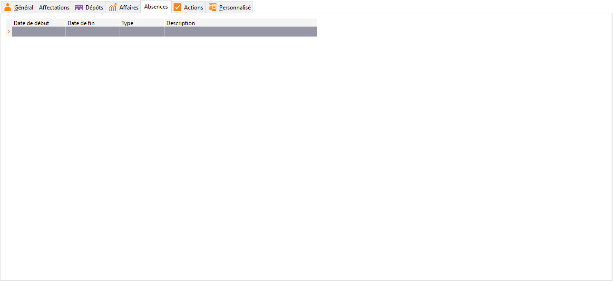

Absences

Dans cet onglet, vous allez pouvoir noter toutes les absences du salarié 
 en ayant la possibilité de préciser le type et de saisir une description 
 personnalisée.

 

Le type d'absence est paramétrable dans les [tables 
 de référence](../../TablesReferences/2/TablesSalaries.htm).

 

Ces absences seront ensuite exploitées dans la gestion du planning des 
 affaires. Vous ne pourrez pas affecter un salarié à un planning des dates 
 où il est absent.

 

