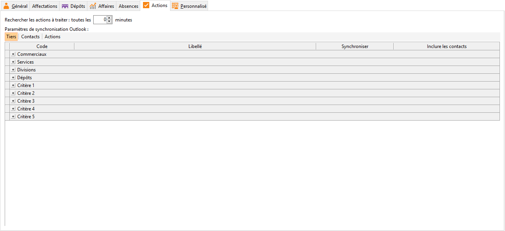

Actions

Cette onglet associé à la Gestion des alertes des actions saisies pour les tiers permet par le champ « Recherche les actions à traiter : toutes les XX minutes » de relancer une alerte dans le délai indiqué.

 

Il permet aussi de paramétrer les éléments qui seront synchronisés avec le connecteur Outlook.

 

