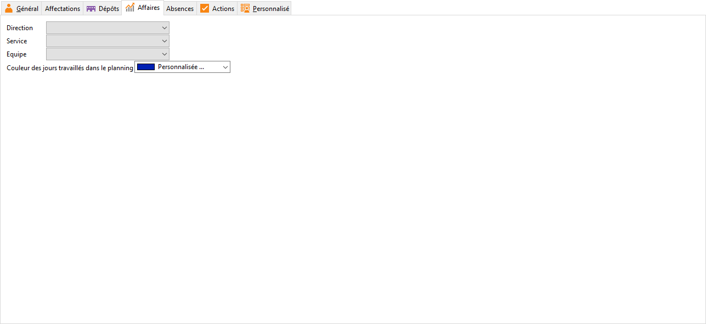

Affaires

Vous pouvez paramétrer ici des éléments qui seront repris par défaut 
 lors de la sélection du salarié dans les onglets budgété et réalisé d'une 
 affaire.

 

Ces données servent aussi dans la gestion des planning des affaires.

 

Ces données sont personnalisables dans les [tables 
 de référence](../../TablesReferences/2/TablesSalaries.htm).

 

