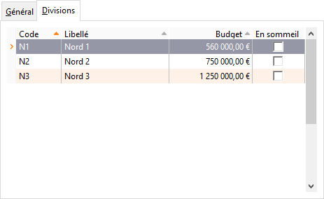

Divisions

Cet onglet permet de créer les divisions associées au service.

 

La colonne "Budget" permet de saisir un montant à titre indicatif. Aucun traitement n’est effectué sur ce montant.

 

Une division peut être affectée à une fiche tiers et sélectionnée sur un document d'achat. Cette sélection permet d’avoir un critère de regroupement supplémentaire dans les statistiques.

 

