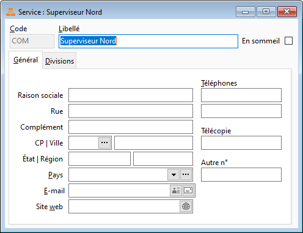

# Service

La création d’un service s'effectue à partir du menu SOCIETE.

 

 

Pour créer un service, vous devez indiqué son code et son libellé.

 

Chaque fiche service est composée des onglets [Général](OngletGeneral.md) et [Divisions](OngletDivisions.md).

 

Un service peut être affecté aux fiches tiers.

