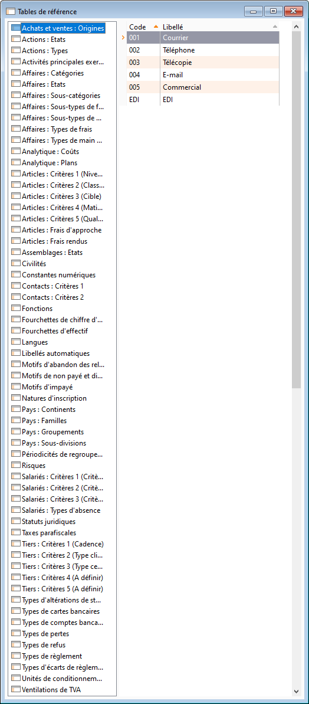
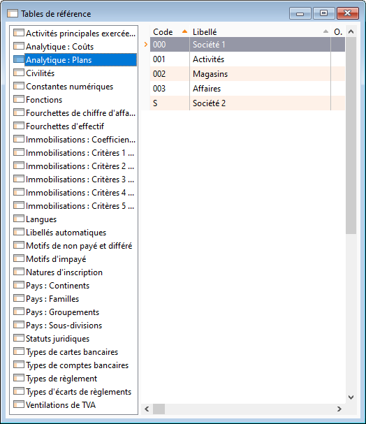

Présentation

A la création de la société, le logiciel propose de créer automatiquement le contenu de certaines tables de référence.

 

A la création de la société, il est indispensable que les tables de référence soient complétées en fonction des besoins et de l'activité de la société.

 

La fenêtre est composée de deux parties : sur la gauche, [la liste des tables de référence](../2/Liste.htm) et sur la droite la [liste des valeurs possibles](../3/SaisieValeurs.htm) existantes pour la table de référence sélectionnée.

 

Pour ajouter une nouvelle donnée dans une table, il faut sélectionner dans la liste, la table à modifier puis cliquer dans la grille de droite pour ajouter ou modifier une donnée.

# ERREUR : variable (GestimumGestionCommerciale) non définie.

# ERREUR : variable (GestimumComptabilité) non définie.

