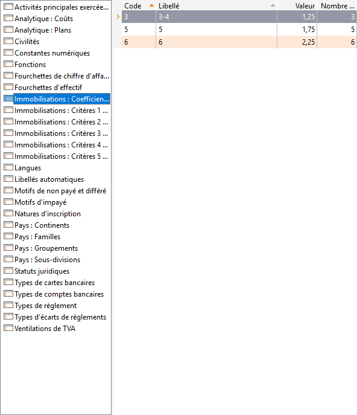

# Tables pour la comptabilité

## Libellés automatiques

Les libellés automatiques (Chèque, Facture,.. ) Pourront être appelés 
 en saisie d'écritures ou dans un guide d'écritures.

 

Un libellé automatique par défaut peut être associé à chaque journal.

## Ventilations TVA

Les codes "Ventilation TVA" sont nécessaires à la génération 
 de l'état préparatoire à la déclaration de TVA.

## Analytiques : plan

Un plan analytique est une organisation composée de sections, mise en 
 place pour suivre les charges et/ou les produits de la société.

## Analytiques : coûts

Un coût analytique sert à regrouper des sections analytiques pour obtenir 
 des ruptures sur coût en édition de balance analytique. Voir la Gestion 
 analytique.

## Immobilisations : Coefficients d'amortissement dégressif

Permet de définir les différents coefficients d'amortissement dégressifs 
 utilisés par votre société, en fonction d'un nombre d'années.

Si aucune donnée n'est renseignée, le coefficients par défaut est appliqué 
 (coefficients 1. 25, 1. 75 Et 2. 25).

 

## Immobilisations : Critères de 1 à 5

Il s'agit d'informations complémentaires sur l'immobilisation mises 
 à votre disposition pour répondre à des caractéristiques des immobilisations 
 propres à votre société.

 

Leur libellé est à définir dans les [Préférences 
 de comptabilité : Onglet Immobilisation](../../PreferencesCompta/2-6/OngletImmobilisations.md).

 

