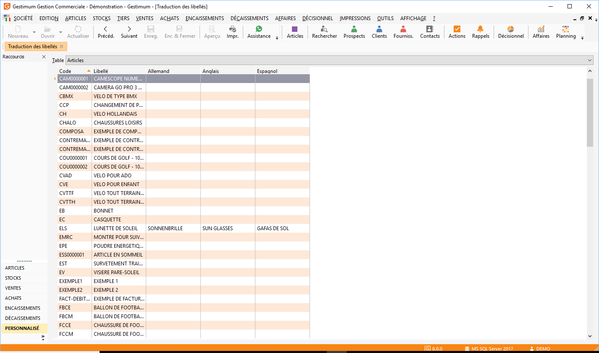

# Traductions des libellés

Gestimum vous propose un système de traduction multi-langues pour les libellés des articles, frais et ports, ainsi que pour les modes de règlements.

 

Le système de traduction est associé à un code langue et permet de récupérer en saisie de documents et à l’impression, un libellé dans une langue étrangère.

 

 

Cette fonctionnalité est disponible en version PME

### Gestion des utilisateurs

Pour accéder à cette fonctionnalité, les options du menu SOCIETE/Utilisateurs/Fichier/Traductions doivent être cochées.

### Tables de référence / langues

Les codes Langues dans les tables de référence du menu SOCIETE doivent être initialisés. Les codes doivent correspondre au codes ISO des codes pays : GB pour l’anglais; SP pour l’espagnol; NL pour le Néerlandais; DE pour l’allemand; IT pour l’italien, etc.

 

La langue pourra être associée à un pays, à un tiers ou saisie directement dans un document

### Document/ onglet entête (suite)

Si le tiers n’a pas de code langue associé, il est possible de lui affecter un code langue directement dans le document lors de sa création pour récupérer automatiquement les traductions effectuées en langue étrangère.

### Fiche tiers / onglet Commercial

Dans la fiche tiers (Onglet Commercial), il est possible d’associer un code langue (il est également récupéré directement de la fiche pays), ce paramètre est repris automatiquement dans un document lors de la sélection du tiers.

 

Ce champ permet d’affecter la désignation traduite dans la langue étrangère du tiers dans les lignes du document, ainsi que les modes de règlements et frais.

### Remarque

Pour un tiers paramétré avec une langue définie dans les tables de référence avec un code "FR", le libellé en français est désormais pris en compte lors de la sélection d’un article dans le document de vente. Pour un tiers sans langue définie dans sa fiche, le libellé en français est également récupéré

 

Pour un Tiers avec une autre langue que le français définie dans sa fiche tiers, lorsque l’article sélectionné dans le document de vente n’a pas de libellé saisi dans cette langue étrangère, le libellé en français est pris en compte.

