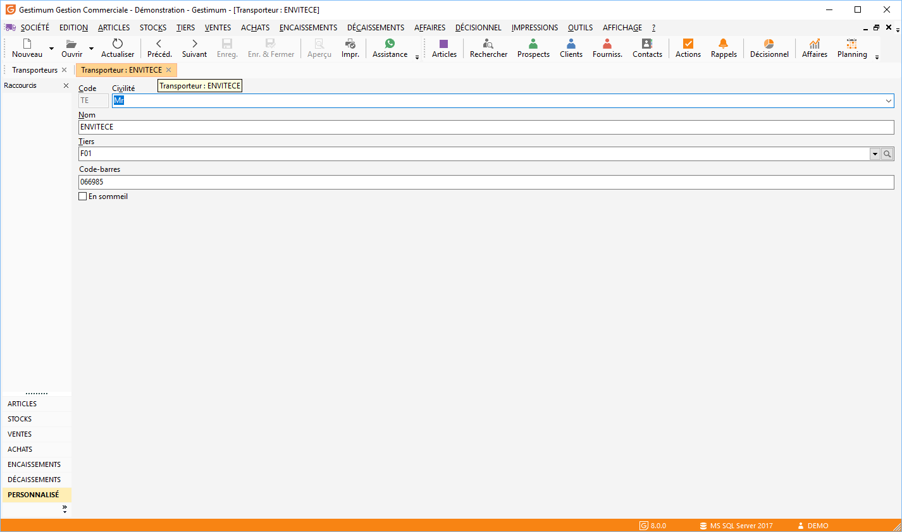

# Transporteur

La création d’un transporteur s’effectue à partir du menu SOCIETE.

 

Pour créer un transporteur, vous devez indiqué son code et son libellé.

 

Vous avez la possibilité de saisir une civilité, de sélectionner un tiers associé à ce transporteur, un code barre et la possibilité de mettre la fiche en sommeil. Cette sélection est à titre indicatif, il n’y a aucun traitement de réaliser à partir de celle-ci.

 

Le transporteur peut être appelé à titre indicatif dans les documents.

 

