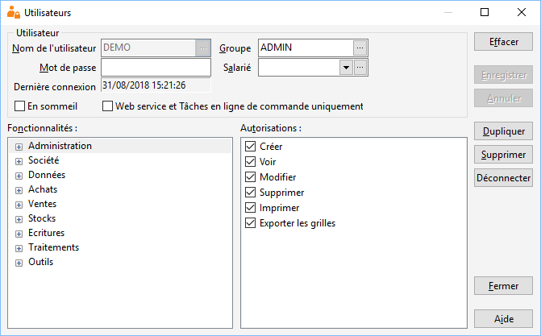

# Introduction

La gestion des droits utilisateurs (création, modification des droits, 
 suppression) ne peut être faite que par un utilisateur ayant tous les 
 droits sur l'option Administration (par défaut Administrateur).

 

## Groupes

La création d'un groupe consiste à saisir un nom de groupe, à définir 
 les droits associés et à l'enregistrer. Tous les utilisateurs appartenant 
 à ce groupe auront par défaut ses droits.

## Utilisateurs

### Création d’un utilisateur

La création d'un utilisateur consiste à saisir un nom d'utilisateur 
 et à le rattacher à un groupe (obligatoire). Et éventuellement un mot 
 de passe.

Les droits du groupe proposés par défaut sont modifiables pour un utilisateur 
 donné. (Le groupe ADMIN accorde tous les droits à l'utilisateur).

### Saisie d’informations complémentaires

Vous avez la possibilité d’associer l’utilisateur à un salarié. La fiche 
 de celui-ci est [paramétrable](../../Salaries/3/OngletAffectations.md) 
 dans le menu SOCIETE | Salariés.

Pour chaque utilisateur, un champ vous indique la date et l’heure de 
 la dernière connexion.

### Modification des droits d’un utilisateur

Vous pouvez modifier les droits d’un utilisateur uniquement si celui-ci 
 n’est pas connecté à la base.

