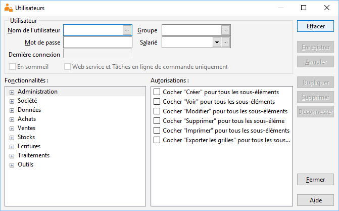

# Paramétrage des utilisateurs

Le paramétrage des utilisateurs est accessible depuis le menu SOCIETE | Utilisateurs.

 

 

Ce menu vous permet de gérer :

 

* [les groupes](Introduction.md) et les [utilisateurs](Introduction.md)
* la [liste des utilisateurs](../3/ListeUtilisateurs.md)
* les [autorisations des groupes 
 et des utilisateurs](../4/Autorisations.md)
* le mot de passe de chacun des utilisateurs
* la mise en sommeil des utilisateurs (Ne permettra plus l’accès 
 à la base, jusqu’à ce que l'option « en sommeil » soit retirée)

 

La case à cocher "Web service et Tâches en ligne de commande uniquement" 
 permet de créer des utilisateurs spécifiques qui ne pourront pas accéder 
 à l'interface visuel du logiciel. Ils sont utilisés uniquement pour gérer 
 les connexions aux fonctions non visuelles (le web service et les tâches 
 en ligne de commande).

 

La gestion des utilisateurs consiste à créer des groupes d'utilisateurs 
 et des utilisateurs ayant des droits particuliers.

 

Pour chaque groupe, les opérations (créer, lire, modifier, supprimer, 
 imprimer) autorisées sur chacune des options (préférences, ventes, fichiers 
 de travail, règlements ... ) doivent être définies.

 

A la [création d'une 
 société](../../Nouvelle/1/CreerNouvelleSociete.md), les groupes ADMIN, DEFAUT et INVITE sont créés :

 

* le groupe ADMIN a été défini avec tous les droits
* le groupe DEFAUT possède tous les droits sauf ceux d’administrer 
 les droits utilisateurs, de gérer les champs personnalisés, de modifier 
 le code débridage et de restructurer la base (vérification de la base 
 en ouverture de société)
* le groupe INVITE possède uniquement le droit de consulter les 
 fichiers (lire). La gestion des documents (création, modification, 
 suppressions) est possible.

 

L'utilisateur renseigné à la création de la société a les droits du 
 groupe ADMIN par défaut.

 

La société de démonstration propose  les utilisateurs ADMINISTRATEUR 
 et DEMO.

