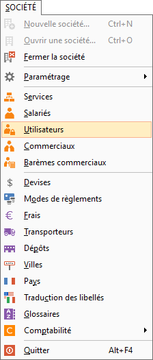
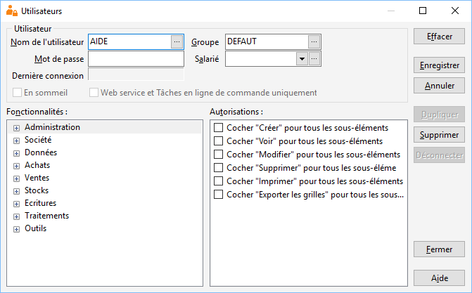
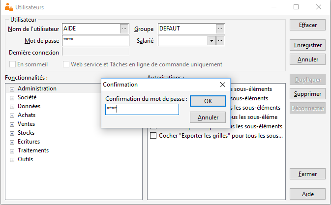
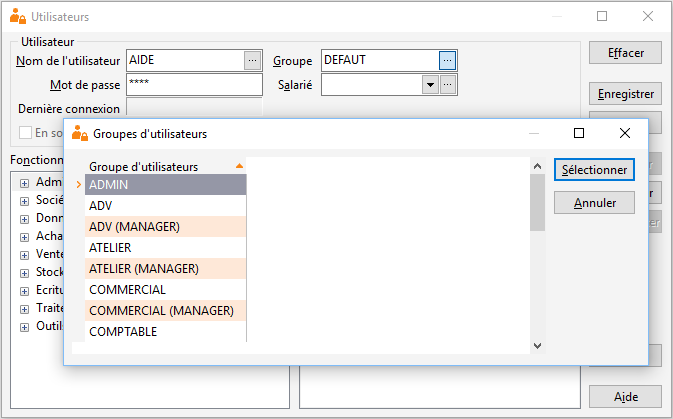
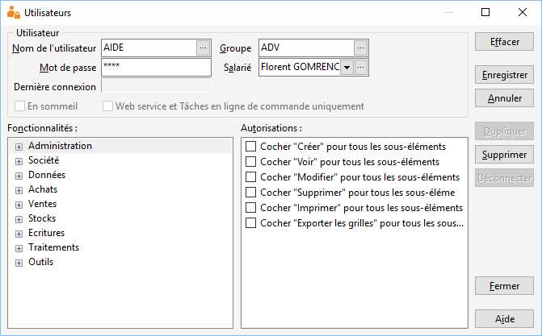
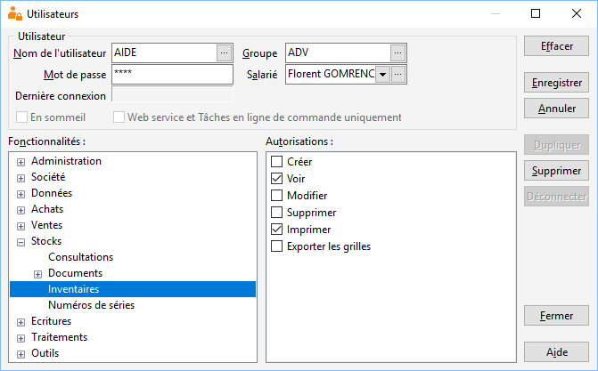

# Droits d'utilisation

Avec La variable « Gestimum\_ERP » n'est pas définie, vous pouvez paramétrer les droits d’utilisation pour chacun de vos salariés qui utiliseront La variable « Gestimum\_Gestion\_Commerciale » n'est pas définie et La variable « Gestimum\_Comptabilité » n'est pas définie.

## Menu

Il faut aller dans le menu SOCIETE | Utilisateurs.

 

## Nom de l’utilisateur

Ensuite on crée un utilisateur en écrivant directement dans "Nom de l’utilisateur".

 

## Mot de passe

On assigne un "mot de passe" à cet utilisateur. Le logiciel vous demandera ensuite une confirmation.

 

## Groupe

Vous pouvez affecter à cet utilisateur un "Groupe".

 

Ce groupe peut être créé au préalable, celui-ci permettra de donner automatiquement et rapidement à l’utilisateur des droits d’utilisation pré-paramétrés.

 

## Salarié

Vous pouvez affecter un salarié à cet utilisateur (pour cela il vous faut au préalable créer un salarié dans le menu SOCIETE | Salariés).

 

Avec cela vous pourrez utiliser les rappels d’actions.

 

## Autorisations

Ensuite vous avez la possibilité de donner des "Autorisations" en sélectionnant à gauche la fonctionnalité puis en cochant à droite l’autorisation.

 

Dans l’exemple suivant, l’utilisateur aura le droit de créer, de voir, de modifier, de supprimer, d’imprimer ou d’exporter un inventaire.

 

 

Sur la partie droite des droits utilisateurs vous pouvez :

* Effacer : permet d’effacer les paramétrages en cours,
* Enregistrer : permet d’enregistrer les modifications effectuées,
* Annuler : permet d’annuler les modifications en cours et de revenir sur la création d’un nouvel utilisateur,
* Dupliquer : permet de créer un autre utilisateur avec le même paramétrage,
* Supprimer : permet de supprimer un utilisateur,
* Déconnecter : permet de déconnecter un utilisateur à distance,
* Fermer : permet de fermer cette fenêtre "utilisateur",
* Aide : permet d’aller dans l’aide Gestimum.

## Liste des fonctionnalités

* Administration
* + Administration
	+ Archives
	+ Champs utilisateurs
	+ Utilisateurs
	+ Filtres de grilles
	+ propriétés de grilles
	+ Purge sociétés
* sociétés
* + Natures comptables
	+ Société, Préférences
	+ Tables de références
* Données
* + Abonnements (Écriture)
	+ Abonnements (Factures)
* Articles
* + Articles
	+ Familles d'articles
	+ Sous-Familles d'articles
	+ Gammes
	+ Tarification des articles
* Affaires
* + Affaires
	+ Général
	+ Champs personnalisés
	+ compta
	+ Budgété
	+ - Frais
		- Main d’œuvre
		- Achats
		- Ventes
	+ Planning
	+ Réalisé
	+ - Frais
		- Main d’œuvre
		- Achats, Ventes
		- Stocks
		- Résultats
	+ Tableau de bord
* Banques et comptes bancaires
* Barèmes
* Budgets
* comptes
* Dépôts
* Devises
* Frais
* Glossaires
* Grilles de tarifs Guides
* journaux
* modes de règlements
* Pays
* Promotions
* Reporting
* Représentants
* Salariés sections Analytiques
* Service
* Tiers
* + Clients
	+ contacts
	+ Familles de tiers
	+ fournisseurs
	+ prospects
	+ Sous-familles de tiers
* Traductions
* Transporteurs
* Villes
* Achats
* documents
* + avoirs et avoirs financiers
	+ Bons de commande
	+ Bons de réception
	+ Bons de retour
	+ Demandes de prix
	+ Factures et factures financières
* générations de commandes
* Réapprovisionnements
* Ventes
* documents
* + Accusés de réception
	+ avoirs bon de livraison
	+ bon de retour
	+ Devis
	+ Factures
	+ Pro Forma
* Stocks
* consultations
* documents
* + Assemblages
	+ Écarts
	+ Entrées
	+ Pertes
	+ Sorties
	+ Transferts
* Inventaires
* Numéros de série
* Écritures
* Saisies
* Ventes
* Achats
* Trésoreries
* OD
* Clôtures & validations comptables
* consultation
* comptes
* Impressions
* Lettrages
* Extourne
* Traitements
* Actions
* Clôture annuelle en gestion
* Décaissements
* + Échéances à payer
	+ Préparation des paiements
	+ historique des paiements
	+ Émissions de paiements
	+ déclaration d'échange de biens
	+ déclaration de TVA
	+ Encaissements
	+ - Échéances à recevoir
		- réception des règlements
		- historique des règlements
		- Remises en banque
	+ États financiers
	+ Rapprochements bancaires
	+ Relances
	+ Statistiques
	+ Tableaux croisés dynamiques
	+ Transfert comptable
* Outils
* + Bascules
	+ Exportation de données
	+ Importation de données Impressions
	+ Outils de vérification
	+ Recalculs
	+ Réimputations
	+ Administration de la base de données

Pour avoir la liste des fonctionnalités, contactez-nous pour que nous vous fournissions un fichier récapitulatif à jour.

