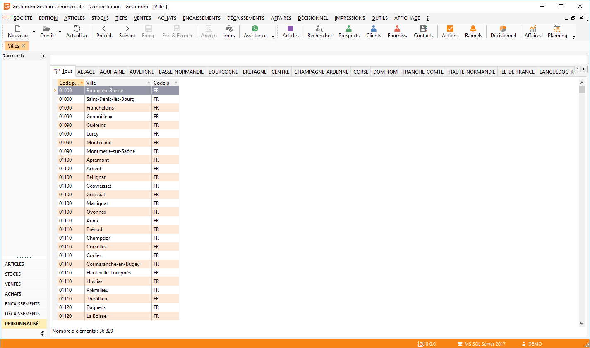

# Liste des villes

La liste des villes (codes postaux) est accessible à partir de la commande villes du menu SOCIETE et permet de gérer (création, modification, suppression, impression) vos fiches villes à partir de la barre d'outils, du menu contextuel ou des raccourcis claviers.

 

Toutes les listes ont un fonctionnement commun.

## Recherche de ville

Utilisez la recherche standard, commune à toutes les grilles ou saisissez dans le champ Recherche en entête de la liste.

## Opérations à partir de la liste des villes

Le menu contextuel permet d’accéder aux opérations de base. La liste des villes peut être triée par code postal ou libellé.

 

