# Automatisation à l'aide du planificateur de tâches Windows

Le planificateur de tâche Windows permet d'automatiser certaines actions 
 à intervalle régulier dans Windows.

 

Nous pouvons utiliser cet outil pour planifier les tâches en ligne de 
 commandes.

 

Pour paramétrer une tâche, vous pouvez suivre les étapes suivantes :

## Planificateur de tâches

Rechercher le planificateur de tâche de Windows et l'ouvrir.

 

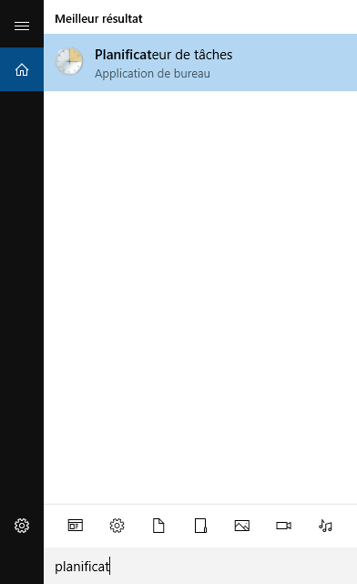
 

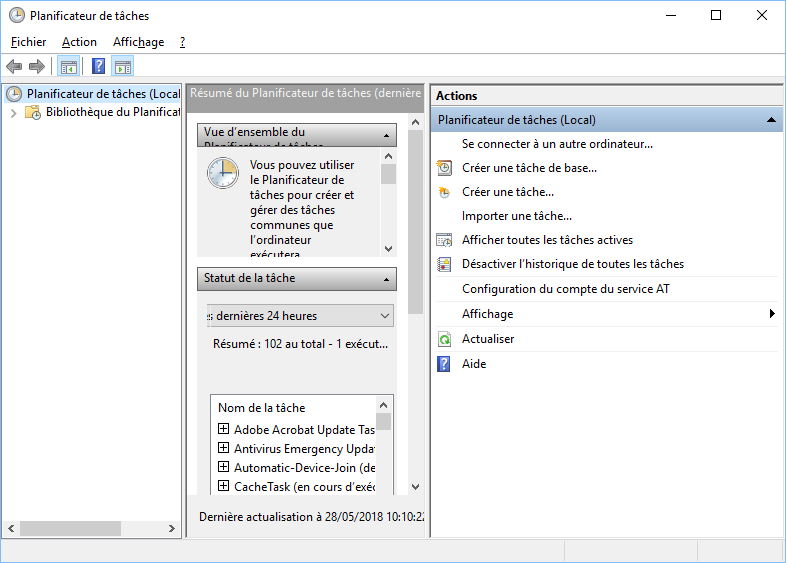
## Création de la tâche

Cliquer sur "Créer une tâche..." dans la partie de la fenêtre.

 

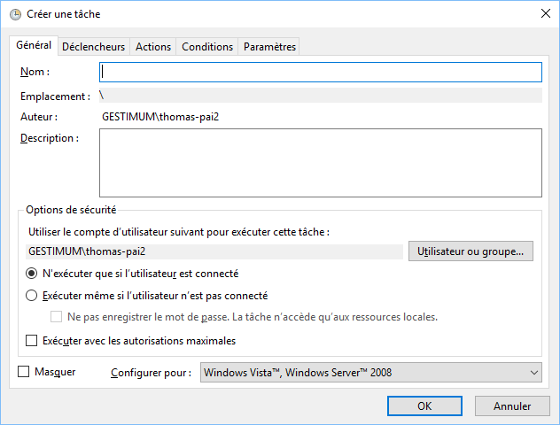
## Nom de la tâche

Donner un nom à la tâche, une description et sélectionner le compte 
 Windows qui devra l'exécuter.

 

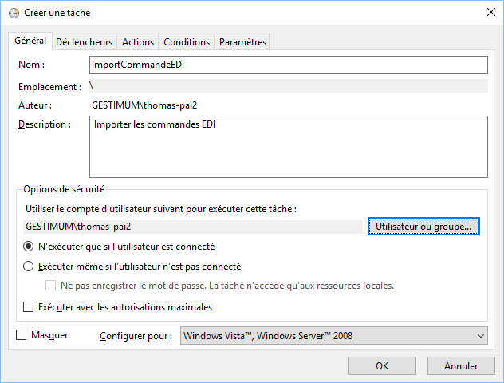
## Déclencheur

Sélectionner l'onglet Déclencheur et cliquer sur Nouveau.

 

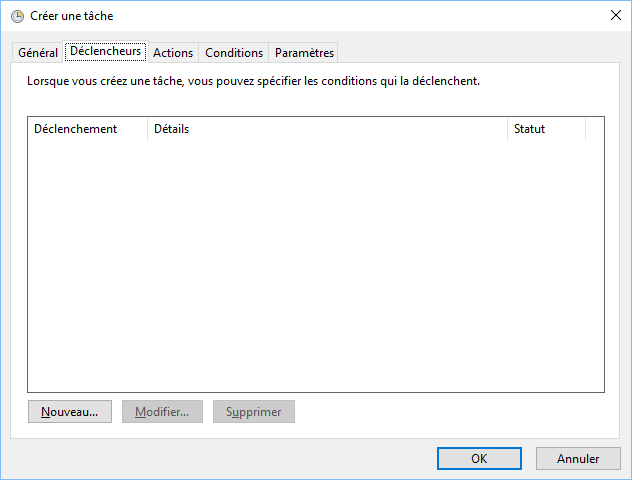 
 
  
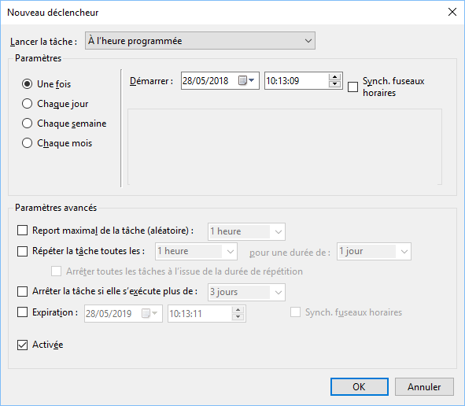
## Périodicité

Définir la périodicité d'exécution de la tâche et cliquer sur Ok. Par 
 exemple ici, la tâche se répète tous les jours à 10:13.

 

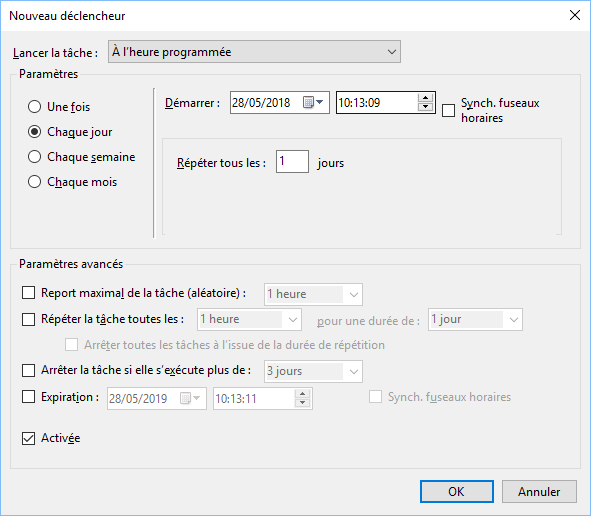 
 
  
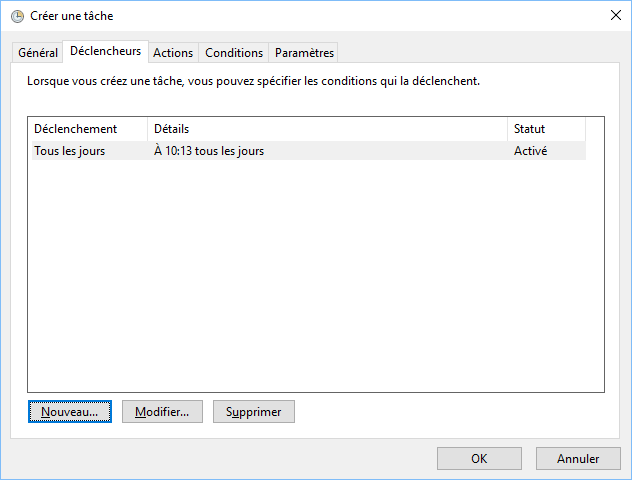
## Action

Sélectionner Actions et cliquer sur Nouveau.

 

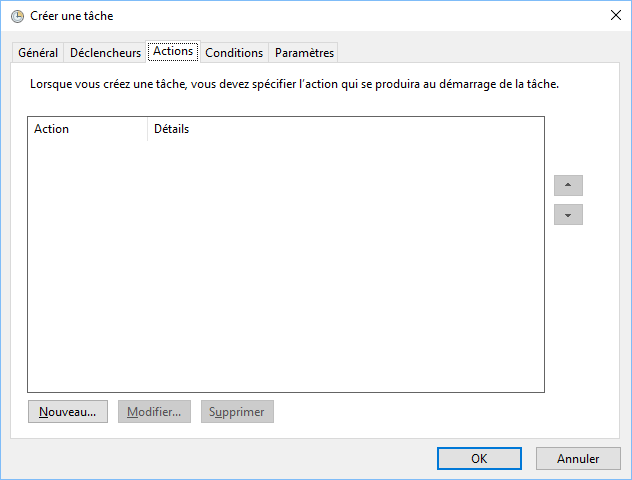 
 
  
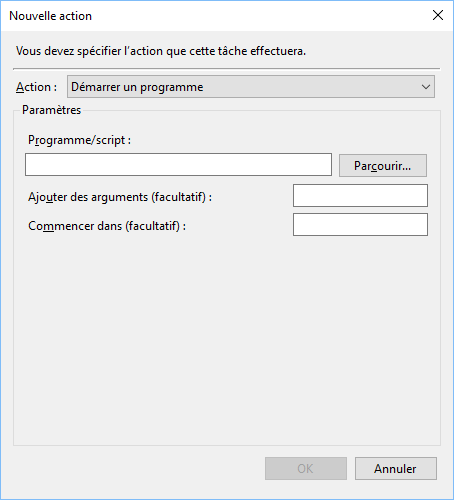
## Fichier .bat

Rechercher le fichier \*.bat contenant la tâche 
 Gestimum à exécuter.

 

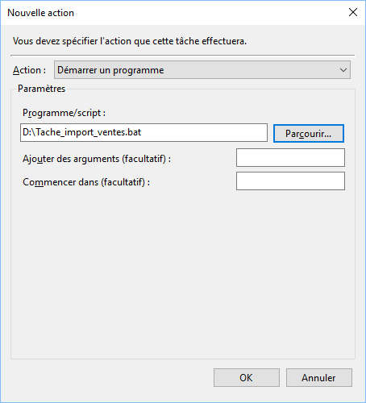 
 
  
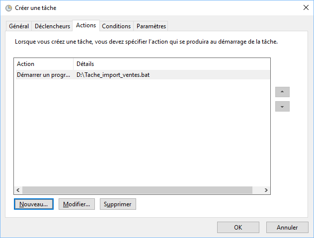
 

Vous pouvez exécuter plusieurs fichiers .bat les un à la suite des autres 
 et les ordonnancer.

 

Par exemple, on peut lancer un import de clients, 
 d'articles et enchaîner avec un import de documents de ventes.

## Bibliothèque du Planificateur

Vous pouvez dès à présent cliquer sur OK et 
 la tâche sera opérationnelle.

 

Pour la retrouver, il faut sélectionner Bibliothèque 
 du Planificateur dans la partie gauche.

 

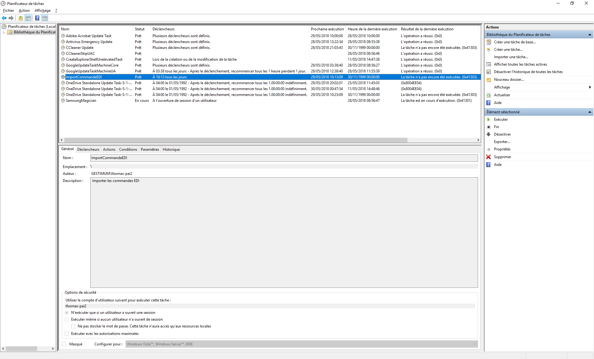

## Pour en savoir plus

[https://msdn.microsoft.com/fr-fr/library/windows/desktop/aa383614(v=vs.85).aspx](https://msdn.microsoft.com/fr-fr/library/windows/desktop/aa383614(v%3dvs.85).aspx)

