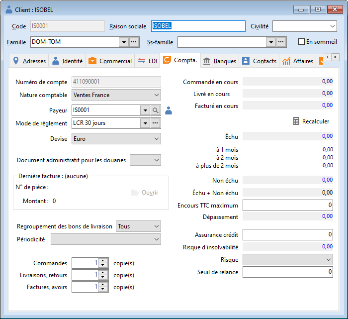

# Paramétrages

La préparation au transfert comptable s’effectue à différents niveaux 
 :

 

* Préférences 
 de la société
* Natures comptables
* Familles, sous-familles, 
 fiches articles
* Familles, sous-familles, 
 fiches tiers
* Documents de 
 ventes et d'achats

## Préférences de la société

Dans le paramétrage de la société (menu SOCIETE 
 | Préférences de la société), l’onglet "Racines" vous 
 permet de déterminer les racines des comptes du plan comptable.

 

 

L’onglet "Comptabilité" vous donne accès :

* A la sélection 
 des comptes d’écart de règlement, écart de change, écart de conversion 
 qui seront employés lors du transfert comptable des règlements et 
 des écritures de ventes ou achats,
* Au choix du libellé 
 par défaut que vous souhaitez avoir à la création d’un journal. Ce 
 choix se reportera sur le libellé de vos écritures réalisées lors 
 d’un transfert,
* A la sélection 
 du journal des opération diverses dans lequel les écritures d’écart 
 et d’escompte seront générées lors du transfert des règlements (remises 
 en banque),
* A la sélection 
 de différentes gestions (échéances, quantités, analytique, TVA sur 
 encaissement).

 

## Natures comptables

Les natures comptables sont utilisées lors de la transformation des 
 factures de ventes et d’achats en pièces comptables de ventes et d’achats.

 

Chaque nature comptable décrit les numéros de comptes , les journaux, 
 les taux de taxes et les natures de TVA et de TPF à utiliser pour chaque 
 article, frais en fonction du client ou du fournisseur.

 

## Articles

Chaque fiche article possède les natures comptables générales (Natures 
 comptables du menu SOCIETE/Comptabilité). 

 

 

Vous pouvez personnaliser pour chaque famille, sous-famille ou fiche 
 article des comptes particuliers. Ces comptes seront prioritaires sur 
 ceux de la nature comptable générale lors du transfert comptable.

 

## Tiers

Sur chaque familles/sous-familles de tiers, vous pouvez affecter une 
 nature comptables de ventes et/ou achats. Lors de l’affectation de la 
 famille et/ou sous-famille sur une fiche tiers, cette nature sera prise 
 en compta.

 

 

Chaque fiche tiers possède un numéro de compte et une nature comptable 
 précise (onglet compta). Ils seront pris en compte lors du transfert comptable 
 d’une pièce ou d’un règlement concernant le tiers.

 

## Documents de ventes et d'achats

Dans l’onglet "Général" de chaque document de vente ou d'achat, 
 la nature comptable du tiers détermine les comptes de la nature comptable 
 de chaque ligne d’article, de chaque frais et remise et le journal (paramétré 
 sur la nature comptable générale du même nom). Ils seront pris en compte 
 lors du [transfert comptable](../4/Destinations.md).

 

