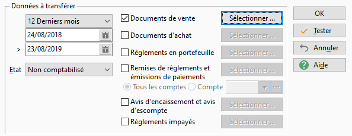

# Données à transférer

## Période

La période détermine les dates des données que vous souhaitez transférer.

## État

La sélection d’un état vous permet de déterminer les limites du transfert.

 

Vous avez le choix entre trois états :

* Non comptabilisé : pour sélectionner les données non encore transférées
* Comptabilisé : pour sélectionner les données déjà transférées
* Tous : pour sélectionner aussi bien les données non comptabilisées que comptabilisées

## Documents de vente

Pour comptabiliser vos documents de vente, vous devez cocher la case "Documents de vente".

## Documents d'achat

Pour comptabiliser vos documents d'achat, vous devez cocher la case "Documents d'achat".

## Règlements en portefeuille

Pour comptabiliser vos règlements en portefeuille, vous devez cocher la case "Règlements en portefeuille".

## Remises de règlements et émissions de paiements

Pour comptabiliser vos remises de règlements et émissions de paiements, vous devez cocher la case "Remises de règlements et émissions de paiements".

 

Vous avez la possibilité de transférer les remises :

* soit de tous les journaux de trésorerie
* soit d'un seul journal

## Avis d'encaissement et avis d'escompte

Pour comptabiliser vos avis d'encaissement et avis d'escompte, vous devez cocher la case "Avis d'encaissement et avis d'escompte".

## Règlements impayés

Pour comptabiliser vos règlements impayés, vous devez cocher la case "Règlements impayés".

## Sélectionner

Les boutons "Sélectionner …" vous permettent de [préciser une par un](DonneesTransferer.md)e quelles données vous souhaitez transférer.

## Données ouvertes et verrouillées

Si des données dont la date est comprise dans la période de sélection sont ouverts et verrouillés, un message de confirmation vous informera de ce fait.

 

Vous aurez la possibilité de voir la liste des données verrouillées avec le nom de l’utilisateur associé.

 

Ces documents seront ignorés par le transfert.

 

Dans la fenêtre de [sélection des données une par une](SelectionDonnees.md), les données verrouillées sont grisées, en italique et barrées.

