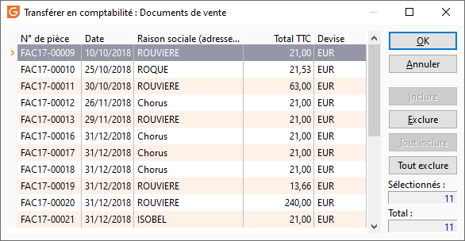
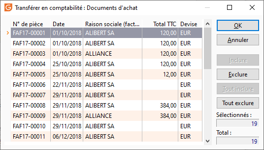
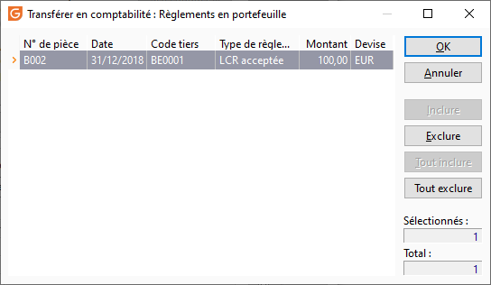
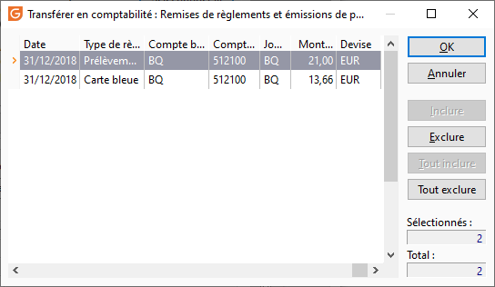
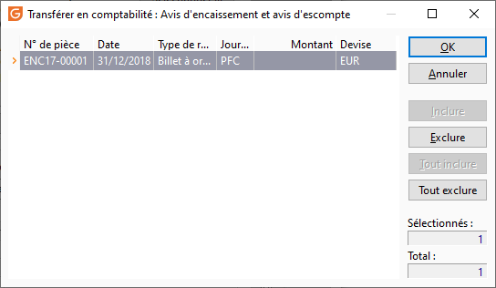
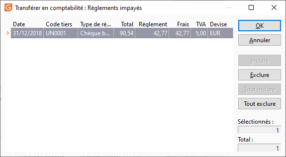

# Sélection des données
## Documents de vente

 

Les pièces présentes dans cette liste résultent [des 
 présélections](DonneesTransferer.md) que vous avez effectués précédemment.

 

Vous avez plusieurs possibilités pour exclure certains documents :

* Clic sur le bouton "Exclure"
* Clic sur "Exclure" 
 dans le menu contextuel
* Double-clic sur la pièce
* Appui sur la touche de clavier 
 Espace
* Appui sur le raccourci clavier 
 Ctrl + X

 

La pièce est alors barrée dans la liste et ne sera pas transférée.

 

Des boutons "Inclure", "Tout inclure" et "Tout 
 exclure" sont également disponibles. Le menu contextuel et des raccourcis 
 clavier sont également affectés à ces fonctions.

 

De plus, le menu contextuel vous permet d'accéder aux fonctions générales 
 d'une grille.

 

En bas à droite de cet écran, deux compteurs sont affichés afin de vous 
 avertir du nombre de documents sélectionnés par rapport au total des documents 
 de la sélection.

## Documents d'achat

## Règlements en portefeuille

## Remises de règlements et émissions de paiements

## Avis d'encaissement et avis d'escompte

## Règlements impayés

