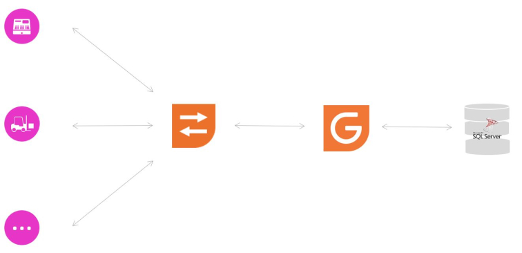

# Bienvenue

Bienvenue dans la documentation de Gestimum Web Service 2 !

Gestimum Web Service 2 
 permet à des logiciels tierces d'échanger 
 avec Gestimum ERP.

Il leur fournit un accès aux fonctionnalités de Gestimum ERP via des requêtes 
 HTTP.

Cette version 2 vient compléter la version 1, qui était spécialisée 
 Comptabilité, avec des requêtes de Gestion Commerciale.

Attention, Gestimum Web Service 2 
 requiert au minimum la version 8 de Gestimum ERP.

Attention, Gestimum Web Service 2 
 est davantage conçu pour répondre à des requêtes lourdes de création de 
 beaucoup de données en tâche de fond, même s'il sait quand même traiter 
 des petites requêtes de création de peu de données.

