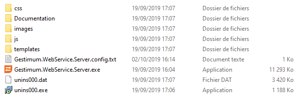

# Architecture

Gestimum Web Service 2 
 est une application Windows embarquant un serveur HTTP.

Depuis la version 2, elle s'installe dans son propre dossier indépendamment 
 du dossier d'installation de Gestimum ERP.

Son dossier d'installation comprend les sous-dossiers et fichiers suivants 
 :

