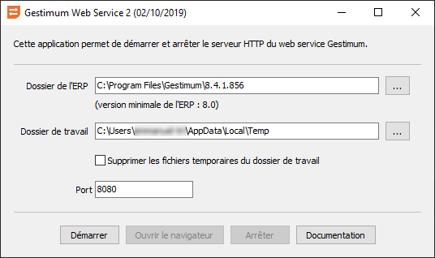

# Démarrage du serveur

Le démarrage du serveur s'effectue depuis la fenêtre suivante, qui permet 
 de :

- paramétrer le dossier de l'ERP, le dossier pour les fichiers de travail 
 temporaires et le port HTTP

- lancer le serveur HTTP

Le port HTTP par défaut est le 8080 mais il peut être changé si ce port 
 est déjà utilisé par un autre logiciel.

