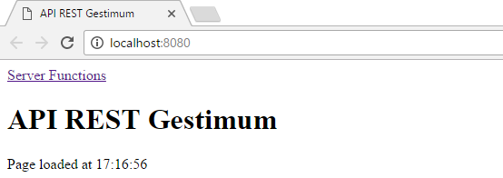

# Console embarquée

Gestimum Web Service 2 
 embarque une console web, disponible uniquement en 
 local.

La page "Server Functions" permet d'exécuter les différentes 
 fonctions de Gestimum Web Service 2 
 :

